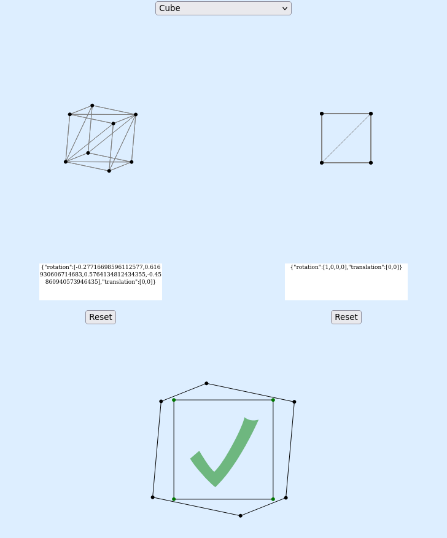

Rupert
=======

[](https://jcreedcmu.github.io/rupert/)

A typescript tool to interactively explore polyhedra that may or may not have the
[rupert
property](https://en.wikipedia.org/wiki/Prince_Rupert%27s_cube).

Demo
----

Live demo [available here](https://jcreedcmu.github.io/rupert/).

Building Static Site
--------------------

```shell
./scripts/prepare-deploy.sh
```
makes a directory `dist` containing all code.

Building for Development
------------------------

Assuming you have nodejs installed,

```shell
$ make
```

should spin up a local http server on port 8000.

Other Targets
-------------

Other make targets are:

```shell
make watch # build js whenever ts source changes
make build # build once
make check # typecheck js whenever ts source changes
make test  # run tests
```

Compiling Tom7's Rupert Polyhedra
---------------------------------

I did
```shell
git svn clone  https://svn.code.sf.net/p/tom7misc/svn/trunk --include-paths 'cc-lib|ruperts' -r 6176 tom7misc-svn
```

To extract [tom7's rupert repo](https://sourceforge.net/p/tom7misc/svn/HEAD/tree/trunk/) and put some more tweaks in https://github.com/jcreedcmu/tom7-rupert-slice . The file `src/raw-poly.ts` is generated from the stdout of doing
```
cd ruperts
make generate
./generate
```
inside that repo.
